# SocialNetwork_Django Project Preview

## Home News Feed
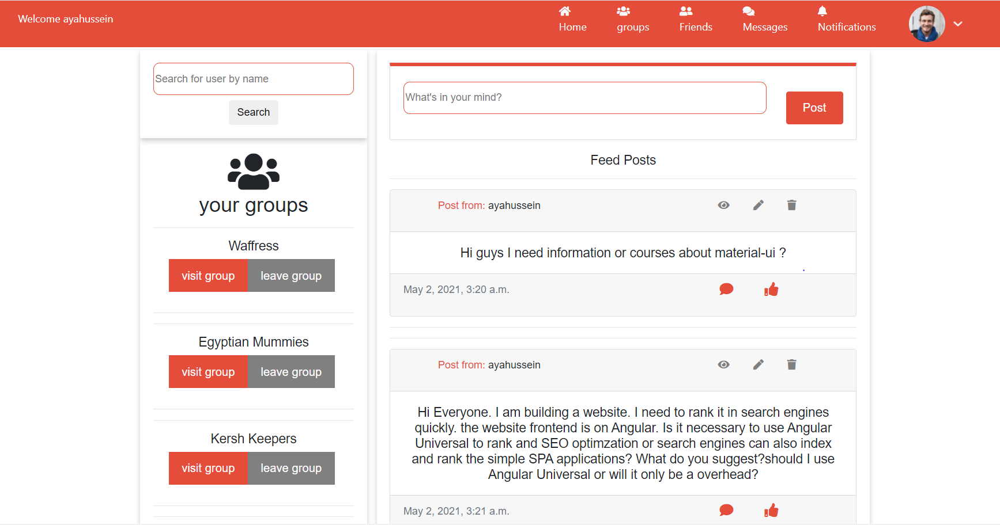

## Message Friend
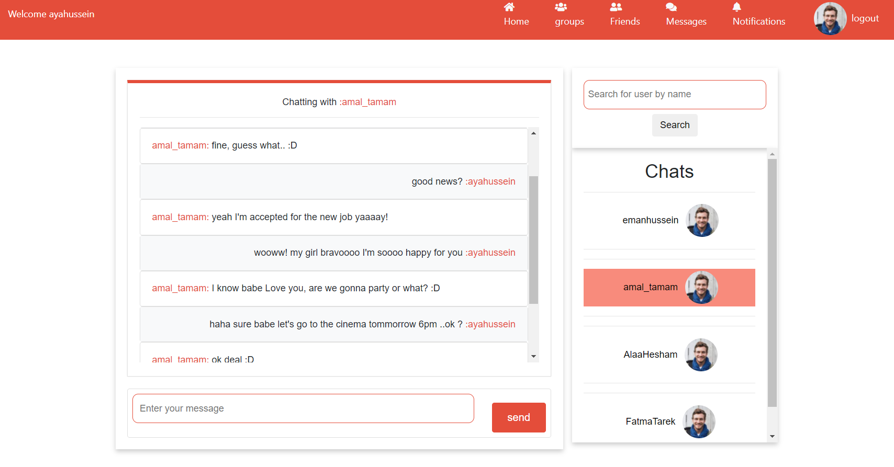

## Groups
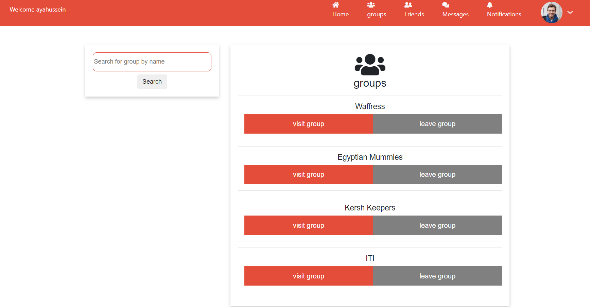

## Group Page

## Group accept request by owner

  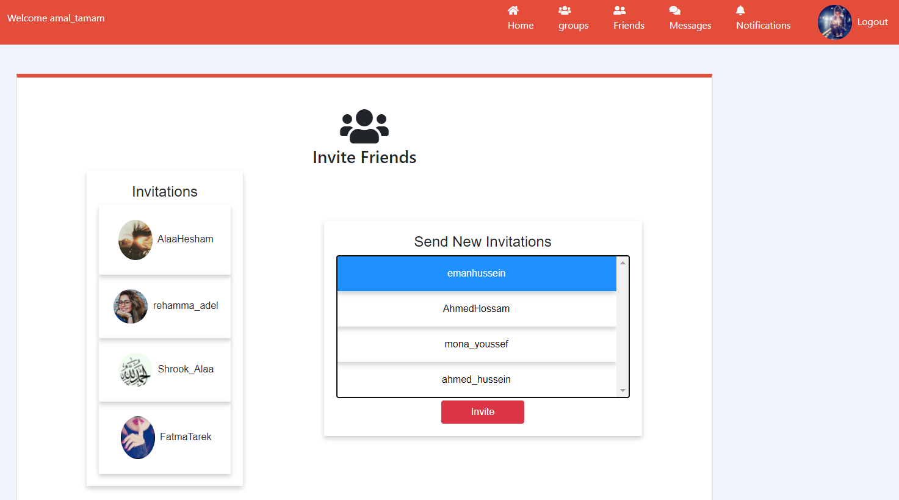
  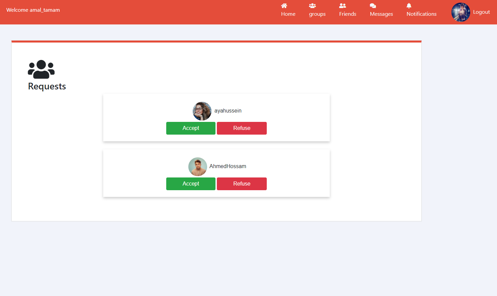 

## Group Invitation
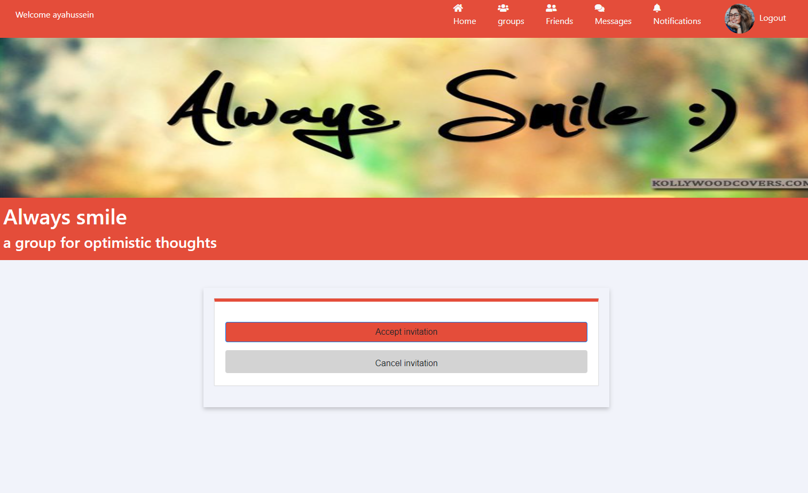

## Notifications
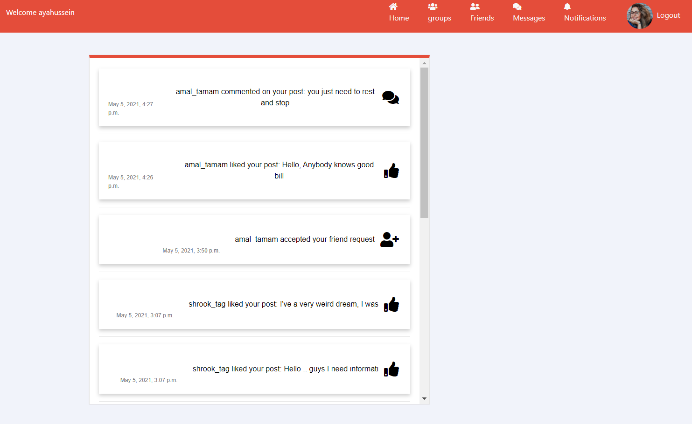

## Search new friends
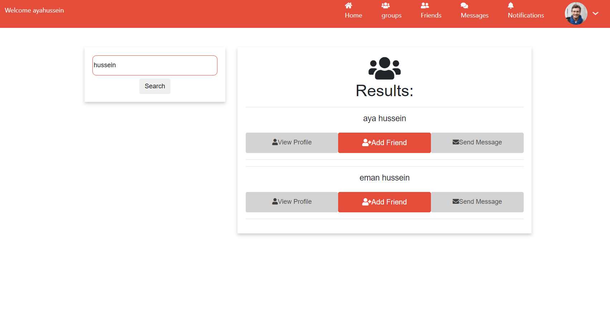

## Friend Request

  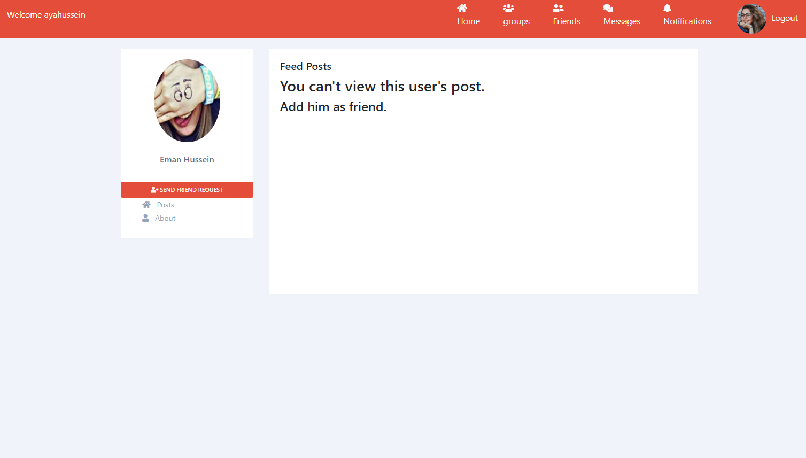
  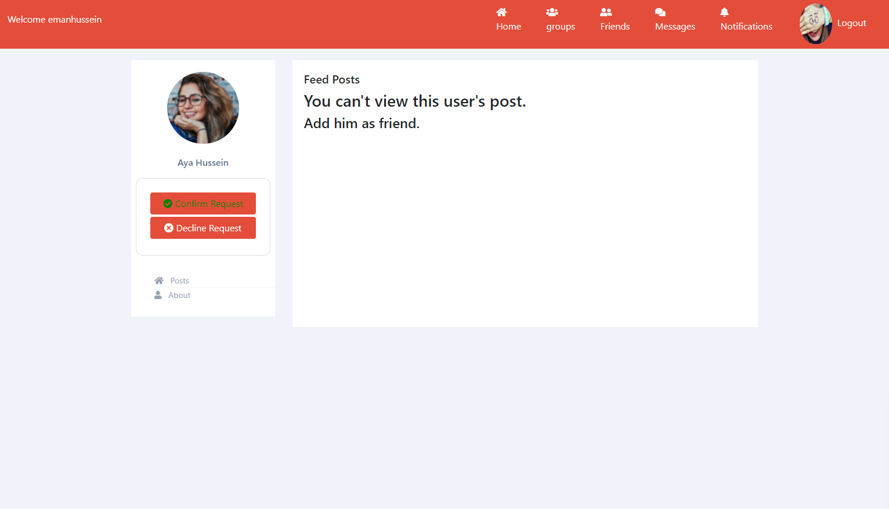 

## Friend List
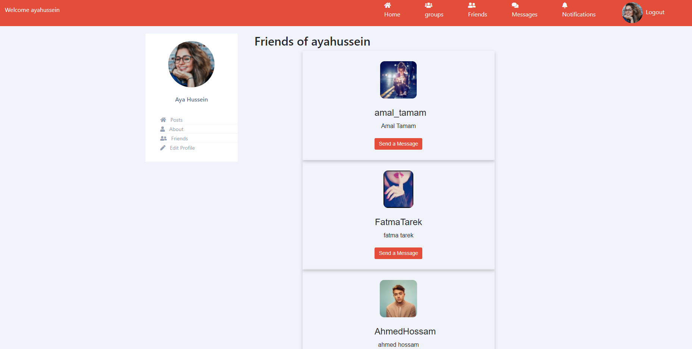

## Friend Profile
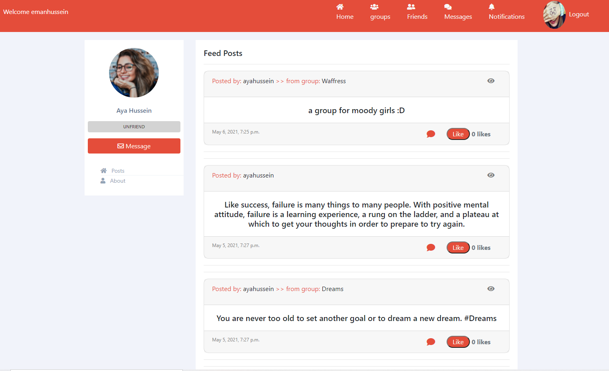

## Edit Profile
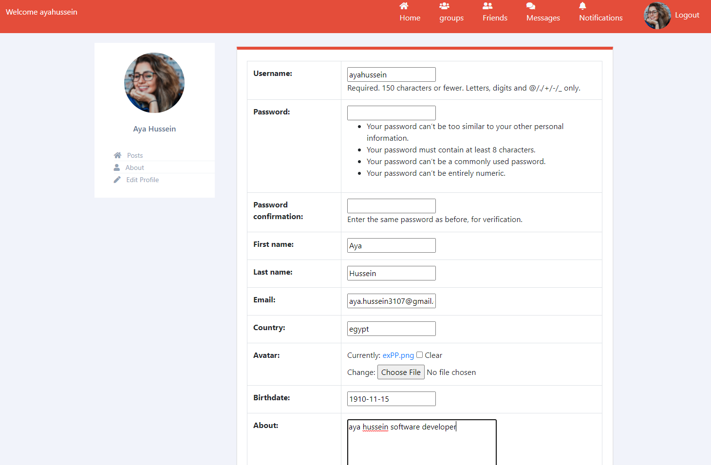

## Post view and Comments

  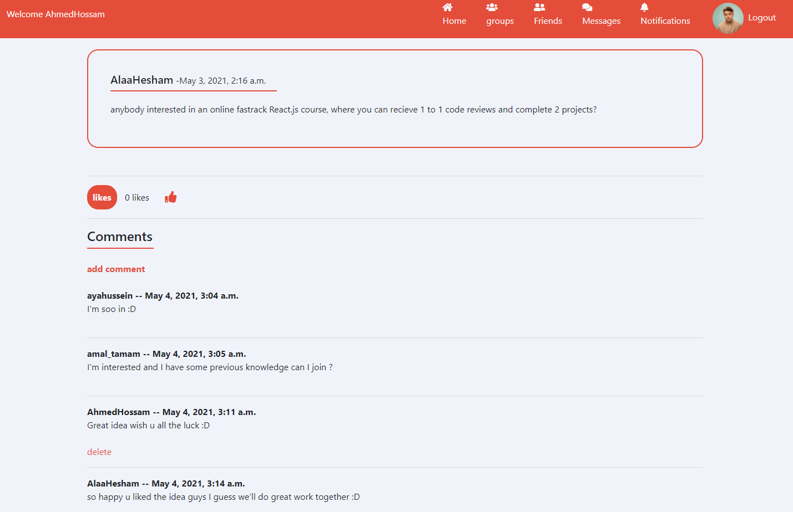
  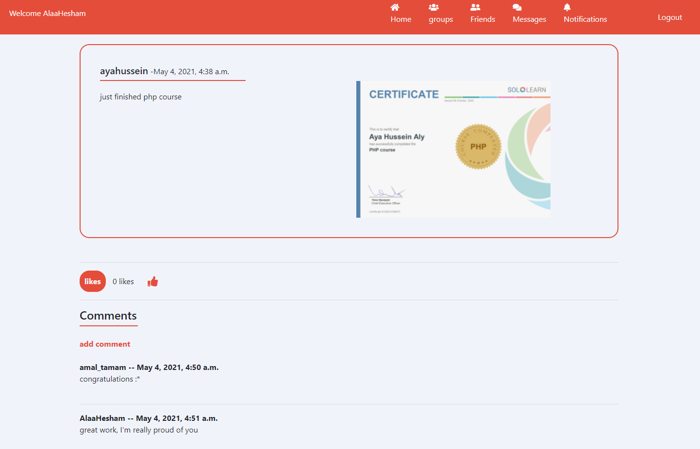 

## Profanity check
  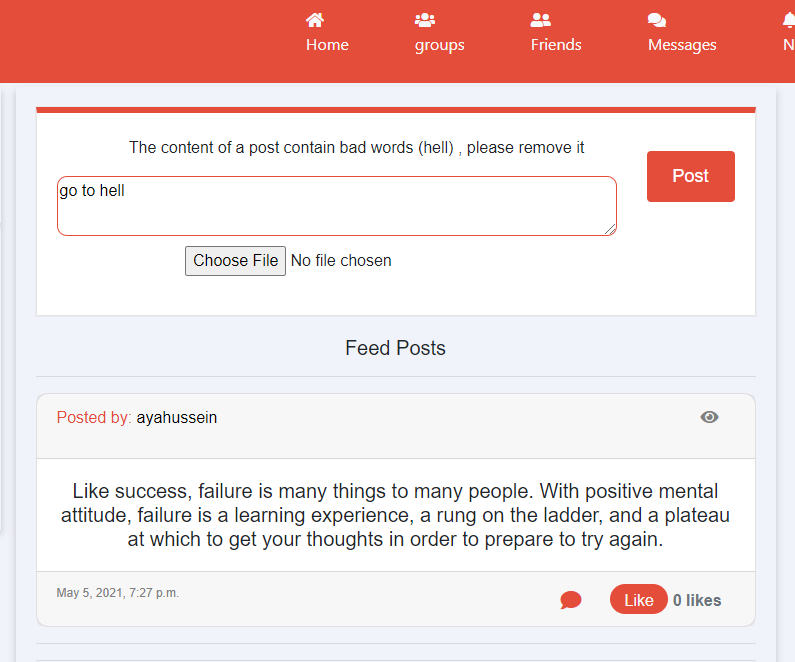 

