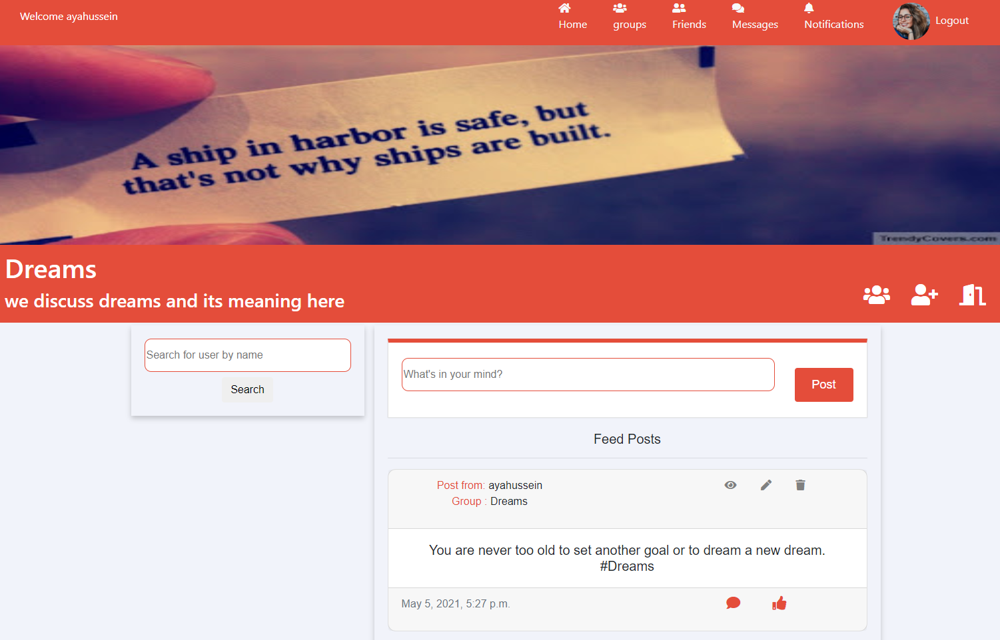
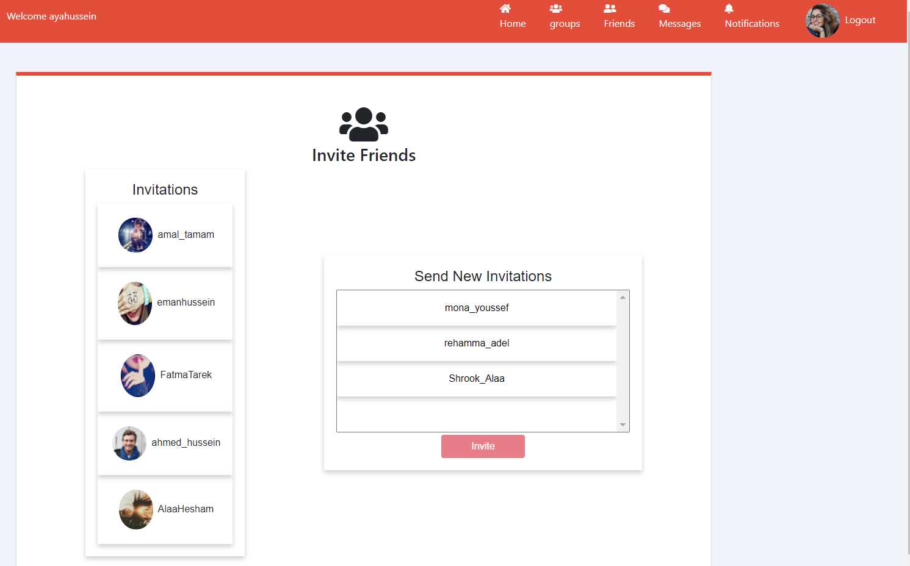
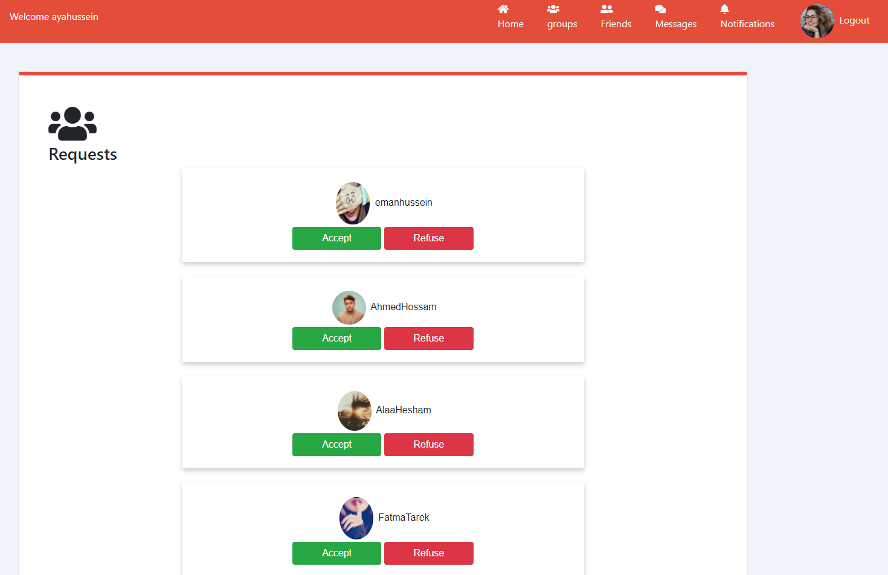
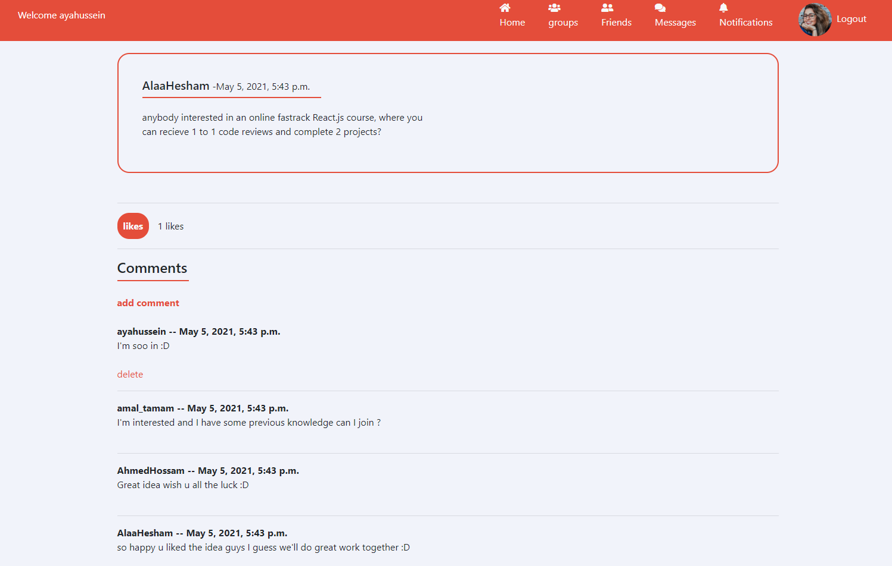
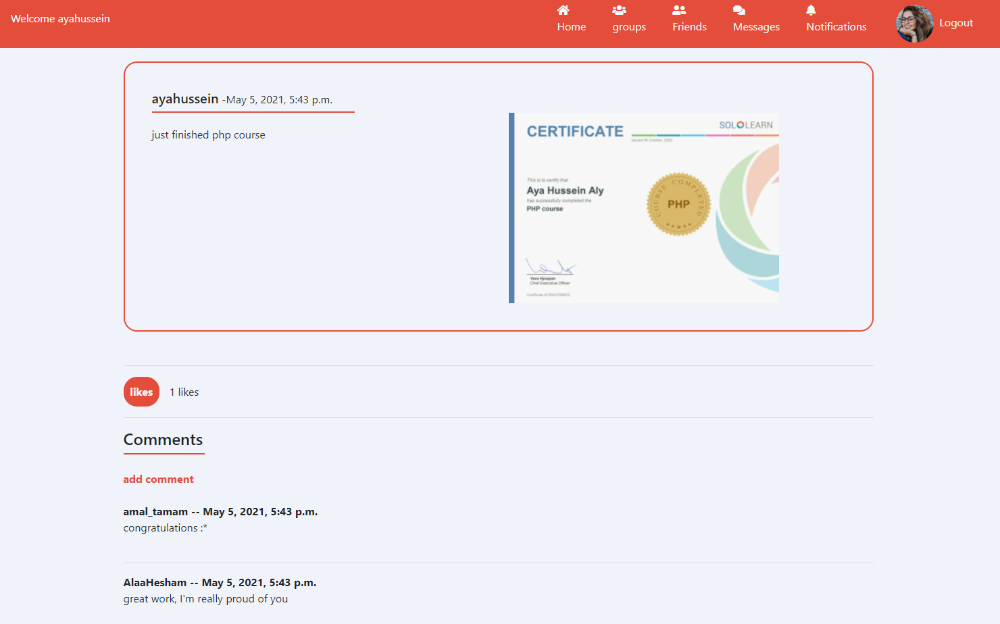

# SocialNetwork_Django Project Preview

## Home News Feed

## Message Friend

## Groups

## Group Page

## Group accept request by owner

  
   

## Group Invitation

## Notifications

## Search new friends

## Friend Request

  
   

## Friend List

## Friend Profile

## Edit Profile

## Post view and Comments

  
   

## Profanity check
   

