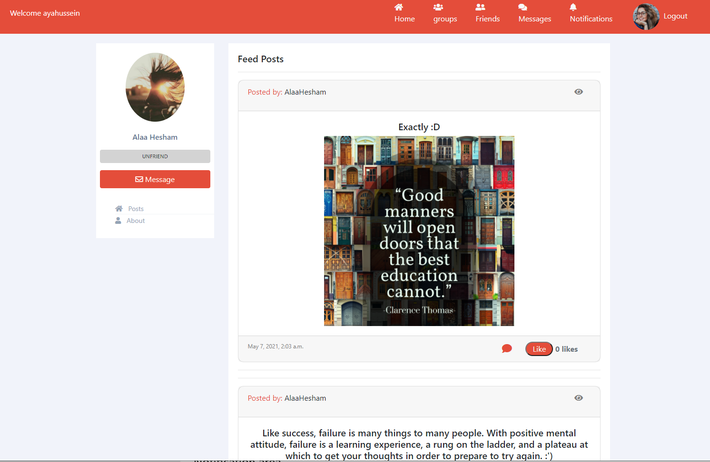

# SocialNetwork_Django Project Preview

## Home News Feed

## Post view and Comments

  
   

## Friend List

## Message Friend

## Groups

## Group Page

## Group Invitation

## Search new friends

## Friend Request

  
   

## Friend Profile

## Notifications

## User Profile

## Edit Profile

## Profanity check

